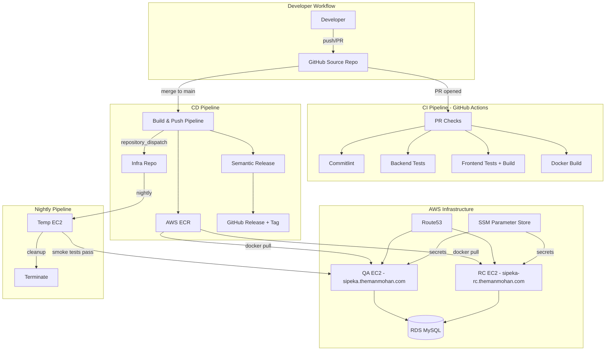
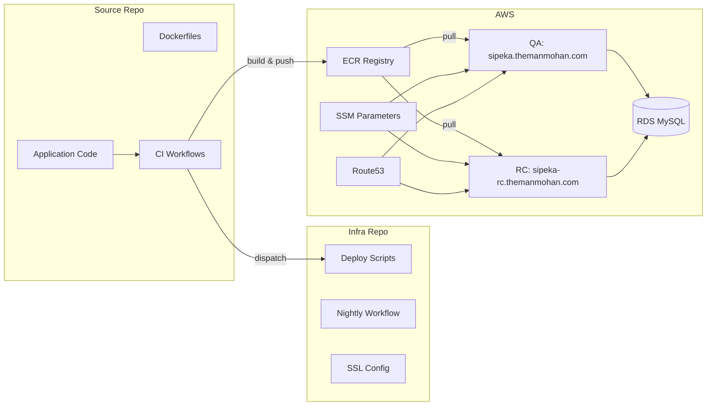

# From Fork to Production: How I Deployed a Full-Stack App to AWS with Docker, CI/CD, and Semantic Release (And Everything That Broke Along the Way)

**By Manmohan Sharma**

> Read this blog on Dev.to: [https://dev.to/manmohan_sharma_a1a85750b/from-fork-to-production-deploying-a-full-stack-app-to-aws-with-docker-cicd-and-semantic-release-1hhi](https://dev.to/manmohan_sharma_a1a85750b/from-fork-to-production-deploying-a-full-stack-app-to-aws-with-docker-cicd-and-semantic-release-1hhi)

---

## 1. The Problem Statement

I needed to deploy a full-stack SPA to AWS with a real CI/CD pipeline — not a toy demo, but the kind of setup that would actually hold up beyond a classroom presentation. The goal: take an open-source application, containerize it, build a complete CI/CD pipeline with GitHub Actions, deploy it to AWS with proper infrastructure, SSL certificates, a custom domain, and semantic versioning. Everything automated. Everything reproducible.

Here's what the final system looks like:



By the end of this project, I had: Docker containers for both frontend and backend, a CI pipeline that blocks bad PRs, a CD pipeline that automatically builds, tags, and deploys on merge, AWS infrastructure with RDS, ECR, EC2, Route53, and SSM, SSL certificates, semantic versioning with auto-generated changelogs, and two live environments (QA and RC). Let me walk you through every step, every failure, and every fix.

---

## 2. Picking an App (And Why I Threw Away My First Choice)

My first instinct was to use [LibreChat](https://github.com/danny-avila/LibreChat) — it's a fantastic project I've been working with. But it has 20+ existing GitHub Actions workflows, uses MongoDB (my assignment required MySQL), and the codebase is massive. Deploying it would be more about wrestling with complexity than demonstrating DevOps principles.

I needed something with a clear checklist:

- React frontend
- Express backend
- MySQL database
- Manageable size
- MIT license
- Clean separation between frontend and backend

I landed on [SiPeKa](https://github.com/ishfrfrg/SiPeKa) — an Employee Payroll System with 197 stars on GitHub. Exact stack match. Clean folder structure: `Frontend/` and `Backend/` directories, React + Vite on the front, Express + Sequelize on the back, MySQL for data.

I forked it to my GitHub. First thing I noticed: everything was in Indonesian. I'd fix that later — it became the perfect demo PR for the CI/CD pipeline.

---

## 3. The First Problem: This App Doesn't Docker

I opened the repo and did a quick inventory:

- No Dockerfile. Not one.
- No `docker-compose.yml`.
- Database credentials hardcoded directly in source files.
- `http://localhost:5000` scattered across **21 frontend files**.
- Zero tests. A `request_test/` folder with empty `.rest` files.
- No health endpoint.

Before I could deploy this anywhere, I needed to make it portable. Docker is how you turn "it works on my machine" into "it works on every machine." But first, the app needed surgery.

---

## 4. Writing the Dockerfiles — Backend

The backend Dockerfile was straightforward but deliberate:

```dockerfile
FROM node:20-alpine

WORKDIR /app

# Copy package files first — Docker layer caching means
# npm ci only reruns when dependencies actually change
COPY package*.json ./
RUN npm ci --only=production

COPY . .

EXPOSE 5000

HEALTHCHECK --interval=30s --timeout=3s --start-period=10s --retries=3 \
  CMD wget --no-verbose --tries=1 --spider http://localhost:5000/health || exit 1

CMD ["node", "index.js"]
```

A few things worth calling out:

**Layer caching**: By copying `package.json` and `package-lock.json` before the rest of the source code, Docker caches the `npm ci` layer. As long as dependencies don't change, rebuilds skip the slow install step entirely.

**HEALTHCHECK**: This instruction tells Docker itself whether the container is alive. It becomes critical later — Docker Compose uses it for startup ordering, and our deploy scripts use the health endpoint for verification.

**The `app.js` refactor**: The original codebase had everything in one file — Express configuration, route mounting, and `app.listen()` all tangled together. I split the Express app config from the server startup so tests could import the app without actually starting a server. This is a small change that unlocks testability.

**The `/health` endpoint**: I added a simple endpoint that returns `{ status: "ok", uptime: process.uptime() }`. This tiny endpoint becomes the foundation for everything: Docker healthchecks, CI smoke tests, deployment verification. If `/health` returns 200, the app is alive.

---

## 5. Writing the Dockerfiles — Frontend (Multi-Stage Build)

The frontend Dockerfile is where things get interesting:

```dockerfile
# Stage 1: Build
FROM node:20-alpine AS build

WORKDIR /app
COPY package*.json ./
RUN npm install --legacy-peer-deps
COPY . .
RUN npm run build

# Stage 2: Serve
FROM nginx:1.27-alpine

COPY --from=build /app/dist /usr/share/nginx/html
COPY nginx.conf /etc/nginx/conf.d/default.conf

EXPOSE 80 443

CMD ["nginx", "-g", "daemon off;"]
```

**Why multi-stage?** The build stage pulls in 500MB+ of `node_modules` — React, Vite, Babel, all the build tooling. But the output of `npm run build` is just static HTML, CSS, and JS files in a `/dist` folder. The final image copies only those files into an Nginx container. Result: ~25MB final image instead of 500MB+. That's a 20x reduction.

**The Nginx routing problem**: This is where I hit my first real head-scratcher. React Router handles client-side routes like `/login`, `/dashboard`, `/employees`. But Express also has a `POST /login` API route. If Nginx proxies all `/login` requests to Express, the browser can't load the login *page* — it gets the API response instead.

**The fix**: Prefix all backend API routes with `/api/`. Nginx proxies `/api/*` to Express, and serves `index.html` for everything else via `try_files`. This is the standard SPA deployment pattern:

```nginx
server {
    listen 80;

    location /api/ {
        proxy_pass http://backend:5000/;
        proxy_set_header Host $host;
        proxy_set_header X-Real-IP $remote_addr;
    }

    location / {
        root /usr/share/nginx/html;
        try_files $uri $uri/ /index.html;
    }
}
```

The `try_files` directive is the key — if the file exists (JS, CSS, images), serve it. If not, serve `index.html` and let React Router handle the route on the client side.

---

## 6. Docker Compose — Making Local Dev Painless

With both Dockerfiles written, I needed a way to run everything together:

```yaml
version: '3.8'

services:
  db:
    image: mysql:8.0
    environment:
      MYSQL_ROOT_PASSWORD: ${DB_PASSWORD:-root_password}
      MYSQL_DATABASE: db_penggajian3
    volumes:
      - ./Backend/db/schema.sql:/docker-entrypoint-initdb.d/init.sql
      - mysql_data:/var/lib/mysql
    healthcheck:
      test: ["CMD", "mysqladmin", "ping", "-h", "localhost"]
      interval: 10s
      timeout: 5s
      retries: 5

  backend:
    build: ./Backend
    environment:
      DB_HOST: db
      DB_USER: root
      DB_PASSWORD: ${DB_PASSWORD:-root_password}
      DB_NAME: db_penggajian3
      SESS_SECRET: ${SESS_SECRET:-dev_secret}
    depends_on:
      db:
        condition: service_healthy
    ports:
      - "5000:5000"

  frontend:
    build: ./Frontend
    ports:
      - "80:80"
    depends_on:
      - backend

volumes:
  mysql_data:
```

A few things to highlight:

**Database seeding**: MySQL's Docker image automatically executes any `.sql` file placed in `/docker-entrypoint-initdb.d/`. One volume mount and the database is initialized with the full schema.

**Health-based startup ordering**: `depends_on` with `condition: service_healthy` means the backend won't start until MySQL is actually accepting connections — not just when the container is running. Without this, the backend tries to connect to MySQL before it's ready, crashes, and you waste 10 minutes debugging why.

**One command**: `docker-compose up` and you have the full app — database, backend, frontend — running locally. That's the whole point. Identical to production.

I also created a `docker-compose.prod.yml` that swaps the local MySQL container for RDS connection strings and pulls pre-built images from ECR instead of building locally.

---

## 7. The Hardcoded URL Problem — 21 Files of `http://localhost:5000`

This one was tedious but important. A simple grep found `http://localhost:5000` hardcoded in **21 frontend files**. Some had `const API_URL = 'http://localhost:5000'`, others had it inline in axios calls like `axios.get('http://localhost:5000/employees')`.

**The fix**: Replace every instance with an empty string, making all API URLs relative. Instead of `axios.get('http://localhost:5000/api/employees')`, it becomes `axios.get('/api/employees')`.

For local development without Docker, I added a Vite dev proxy:

```js
// vite.config.js
export default defineConfig({
  server: {
    proxy: {
      '/api': 'http://localhost:5000'
    }
  }
})
```

In Docker, Nginx handles the proxying. In dev mode, Vite handles it. The frontend code doesn't care — it just hits `/api/whatever` and the right thing happens.

This is a common issue when "Dockerizing" an app that was only ever run in dev mode. The app assumes frontend and backend are on different ports/origins. In a Docker deployment with Nginx as a reverse proxy, they're behind the same origin.

---

## 8. Database Config — No More Hardcoded Credentials

The original `Database.js` was a security horror show:

```js
const db = new Sequelize('db_penggajian3', 'root', '', {
  host: 'localhost',
  dialect: 'mysql'
});
```

Hardcoded database name, hardcoded root user, empty password, hardcoded localhost. This works on your laptop. It works nowhere else.

The fix:

```js
const db = new Sequelize(
  process.env.DB_NAME || 'db_penggajian3',
  process.env.DB_USER || 'root',
  process.env.DB_PASSWORD || '',
  {
    host: process.env.DB_HOST || 'localhost',
    dialect: 'mysql'
  }
);
```

Environment variables with sensible defaults. Works locally with defaults, works in Docker with env vars from `docker-compose.yml`, works in production with SSM-injected values.

I also added `store.sync()` for the session table. Without this, the express-session Sequelize store doesn't create its table, so login succeeds (credentials are correct) but the session isn't persisted. You log in, get redirected, and immediately get bounced back to the login page because there's no session. That one cost me 30 minutes of staring at network requests before I figured it out.

---

## 9. Adding Tests to a Zero-Test Codebase

The repo had zero automated tests. A `request_test/` folder contained empty `.rest` files — placeholders that never got filled in.

My philosophy for this was pragmatic: for CI/CD, you need a quality gate. Not 100% coverage — just enough to catch "the app is fundamentally broken."

**Backend tests (7 tests with Vitest + Supertest):**

```js
describe('Health Endpoint', () => {
  it('returns 200 OK', async () => {
    const res = await request(app).get('/health');
    expect(res.status).toBe(200);
  });

  it('returns valid JSON with status and uptime', async () => {
    const res = await request(app).get('/health');
    expect(res.body).toHaveProperty('status', 'ok');
    expect(res.body).toHaveProperty('uptime');
  });
});

describe('Auth Routes', () => {
  it('returns 401 without session', async () => {
    const res = await request(app).get('/api/me');
    expect(res.status).toBe(401);
  });

  it('rejects login with empty credentials', async () => {
    const res = await request(app)
      .post('/api/login')
      .send({ email: '', password: '' });
    expect(res.status).toBe(400);
  });
});
```

**Frontend tests (4 tests with Vitest + jsdom):**

- React imports correctly
- Redux store initializes
- React Router imports resolve
- App component renders without crashing

**Total: 11 tests. Run time: under 2 seconds.** Simple, but they catch the things that matter — the app starts, the health endpoint works, authentication is enforced, the frontend builds and renders. If any of these fail, something is seriously wrong.

---

## 10. CI Pipeline — PR Checks That Actually Block Bad Code

With tests in place, I built the CI pipeline. The philosophy: every PR must pass automated checks before it can be merged. No exceptions.

**Commitlint**: I configured [commitlint](https://commitlint.js.org/) to enforce [Conventional Commits](https://www.conventionalcommits.org/). Every commit message must follow the pattern `type: description` — `feat:`, `fix:`, `docs:`, `chore:`, etc. Bad message format = PR blocked. This isn't just style policing — Semantic Release uses these prefixes to automatically determine version bumps.

The `pr-check.yml` workflow runs **4 jobs in parallel**:

1. **Commit validation** — commitlint checks all commit messages in the PR
2. **Backend tests** — install deps, run Vitest
3. **Frontend tests + build** — install deps, run Vitest, then `npm run build` (catches build errors)
4. **Docker build** — build both Docker images (catches Dockerfile errors)

Then the failures started.

**Failure #1: Missing lock file.** `npm ci` requires `package-lock.json` to exist. The original repo had it in `.gitignore`. Fix: remove `package-lock.json` from `.gitignore`, generate and commit the lock file.

**Failure #2: Case sensitivity.** The frontend imported images from `Assets/` (capital A). macOS is case-insensitive, so this worked fine locally. GitHub Actions runs on Linux, which is case-sensitive. `Assets/` !== `assets/`. Fix: `git mv Frontend/src/Assets Frontend/src/assets` and update all imports.

**Failure #3: Peer dependency conflicts.** The project used React 18 with some older Vite plugins that declared peer dependency ranges for React 17. `npm ci` fails by default when peer deps conflict. Fix: use `npm install --legacy-peer-deps` in CI workflows. Not ideal, but pragmatic.

Three failures, three fixes, three lessons. This is normal. CI exists to catch exactly these kinds of issues before they reach production.

---

## 11. AWS — Setting Up the Playground

I set up all AWS infrastructure via CLI commands — no clicking around in the console. Everything reproducible.

**RDS MySQL (db.t3.micro):** The production database. Imported the SQL schema. The security group only allows connections from the app EC2's security group — not the public internet. This means even if someone gets the database credentials, they can't connect unless they're on an authorized EC2 instance.

**ECR (Elastic Container Registry):** Two repositories — `sipeka-backend` and `sipeka-frontend`. This is our private Docker registry. GitHub Actions pushes images here; EC2 instances pull from here.

**EC2 instances (2x t3.small):** QA and RC environments. Bootstrapped with a userdata script that installs Docker and Docker Compose on first boot.

**IAM Role:** The EC2 instances have an IAM role that allows them to pull from ECR and read SSM parameters. No hardcoded AWS keys on the instance. Ever.

**SSM Parameter Store:** Database host, user, password (encrypted with KMS), session secret (encrypted). The deploy script fetches these at container startup. Secrets never touch a `.env` file, never get committed to git, never appear in Docker image layers.

**Security Groups:**

| Security Group | Ports | Source |
|---|---|---|
| App SG | 22 (SSH), 80 (HTTP), 443 (HTTPS), 5000 (API) | 0.0.0.0/0 |
| RDS SG | 3306 (MySQL) | App SG only |

**Cost:** About $45/month when everything's running. About $2/month with EC2 and RDS stopped. My approach: stop everything when not actively developing or presenting, start it up when needed.

---

## 12. The Build Pipeline — Merge to Main, Deploy to Production

The `build-push.yml` workflow triggers on every push to `main`:

1. **Run all tests** — fail fast. Don't waste 5 minutes building Docker images if a test fails in 2 seconds.
2. **Build both Docker images** — backend and frontend.
3. **Push to ECR** — tagged with both the git SHA (unique, traceable) and `latest` (for easy pulling).
4. **Trigger the infra repo** — via `repository_dispatch` event. This tells the infrastructure repo "hey, there are new images ready to deploy."

**Semantic Release** runs in parallel with the build:

- Analyzes all commit messages since the last release
- Determines the version bump: `feat:` = minor (v1.0.0 → v1.1.0), `fix:` = patch (v1.1.0 → v1.1.1)
- Generates a CHANGELOG entry
- Creates a git tag
- Publishes a GitHub Release

The result: every merge to `main` automatically produces versioned Docker images in ECR and a GitHub Release with a changelog. No manual tagging. No "what version is deployed?" conversations. The commit messages *are* the release notes.

---

## 13. The Infra Repo — Why Two Repos?

The project uses two repositories — a source repo (app code) and an infra repo (deployment logic). I split the repos because I didn't want deployment scripts mixed in with application code. A developer adding a feature shouldn't need to touch deployment workflows, and a deployment fix shouldn't require changes to the app.

**Source repo contains:**

- Application source code
- Dockerfiles and docker-compose files
- CI workflows (PR checks, build & push)

**Infra repo contains:**

- Deployment scripts
- Nightly smoke test workflow
- Nginx SSL configuration
- RC promotion workflow

**The nightly workflow** is the most interesting piece:

1. Spin up a temporary EC2 instance
2. Pull the latest images from ECR
3. Run smoke tests — health endpoint returns 200, frontend serves HTML, auth endpoint responds
4. If all tests pass, deploy to the QA EC2 instance
5. Terminate the temporary instance

This means the QA environment is automatically updated every night with the latest passing build. If smoke tests fail, nothing gets deployed and the team gets notified.

**The deploy script** does the actual deployment:

1. SSH into the target EC2 instance
2. Fetch secrets from SSM Parameter Store
3. Stop old containers (`docker stop`)
4. Pull new images from ECR (`docker pull`)
5. Start new containers with environment variables from SSM
6. Verify the health endpoint returns 200

---

## 14. The `/login` Bug — When It Hit Me in Production

Remember the Nginx routing problem from Section 5? Here's what it actually looked like when I deployed to EC2 for the first time.

I navigated to `http://<IP>/login` in my browser and got: `Cannot GET /login`. The login page worked perfectly in local dev mode, but on EC2, Nginx was forwarding the browser's GET request to Express, which only had a POST handler for `/login`. Express returned "Cannot GET /login."

This is when I went back and added the `/api/` prefix to all backend routes, updated all 21 frontend API calls, and fixed the Nginx config. It was the same fix I described earlier, but I'm calling it out separately because this is **the** classic SPA deployment bug. If you take one thing from this blog: frontend routing and backend API routing must never overlap. Prefix your API routes. Always.

---

## 15. Domain and SSL

A production deployment needs a real domain and HTTPS. Here's what I did:

**Route53 setup:**

- Created a hosted zone for `themanmohan.com`
- Added A records: `sipeka.themanmohan.com` → QA EC2 IP, `sipeka-rc.themanmohan.com` → RC EC2 IP
- Updated nameservers at the domain registrar to point to Route53's NS records

**SSL via Let's Encrypt:**

```bash
sudo certbot certonly --standalone -d sipeka.themanmohan.com
```

Then updated the Nginx config to serve over HTTPS:

```nginx
server {
    listen 80;
    server_name sipeka.themanmohan.com;
    return 301 https://$host$request_uri;
}

server {
    listen 443 ssl;
    server_name sipeka.themanmohan.com;

    ssl_certificate /etc/letsencrypt/live/sipeka.themanmohan.com/fullchain.pem;
    ssl_certificate_key /etc/letsencrypt/live/sipeka.themanmohan.com/privkey.pem;

    location /api/ {
        proxy_pass http://backend:5000/;
        proxy_set_header Host $host;
        proxy_set_header X-Real-IP $remote_addr;
    }

    location / {
        root /usr/share/nginx/html;
        try_files $uri $uri/ /index.html;
    }
}
```

The `/etc/letsencrypt` directory is mounted into the frontend container as a volume, so the Nginx process inside Docker can read the certificates from the host.

**Auto-renewal:** A cron job runs at 3 AM, stops Nginx briefly for the renewal (certbot needs port 80), then restarts it. Let's Encrypt certs expire every 90 days, so this keeps things fresh without manual intervention.

---

## 16. Semantic Release and RC Promotion

Semantic Release is the automation layer that ties commit discipline to version management.

The `.releaserc.json` configuration chains together plugins:

1. **commit-analyzer** — reads commit messages, determines bump type
2. **release-notes-generator** — generates human-readable release notes
3. **changelog** — updates `CHANGELOG.md`
4. **git** — creates the version tag
5. **github** — publishes the GitHub Release

The math is simple:

- Commit with `feat:` prefix → **minor** bump (v1.0.0 → v1.1.0)
- Commit with `fix:` prefix → **patch** bump (v1.1.0 → v1.1.1)
- Commit with `BREAKING CHANGE` → **major** bump (v1.1.1 → v2.0.0)
- Commits with `docs:`, `chore:`, `style:` → **no release** (they don't affect the running software)

The **RC promotion workflow** ties it all together. When Semantic Release publishes a new version (say `v1.1.3`), the `release.yml` workflow fires a `repository_dispatch` event to the infra repo with the version tag and git SHA. The infra repo's `rc-deploy.yml` then:

1. Retags the image in ECR using the AWS ECR API — copies the manifest from the SHA tag to the version tag (e.g., `c450be94...` → `v1.1.3`). No docker pull/push needed, just a manifest copy.
2. SSHes into the RC EC2 instance
3. Pulls the version-tagged image and deploys it

The key detail: the image in ECR gets tagged with a **human-readable version number** (like `v1.1.3`), not a git SHA. So when I check what's running on RC, I see `sipeka-backend:v1.1.3` instead of `sipeka-backend:c450be9416e9bb923f1d3a4b`. That's the whole point — traceability.

Result: `sipeka-rc.themanmohan.com` always runs the latest release candidate, with its own SSL certificate, tagged with a proper version number.

---

## 17. Proving It Works — The Translation PR

All this infrastructure means nothing if I can't demonstrate the full cycle working end-to-end. So I created a real feature branch.

The original app was entirely in Indonesian — all UI labels, button text, page titles, form placeholders. I created a branch called `feat/english-translation` and translated the UI across 26 files.

The commit message: `feat: translate UI from Indonesian to English`

I opened **PR #1**. Within seconds, four checks kicked off:

| Check | Result |
|---|---|
| Commitlint | PASS |
| Backend Tests | PASS |
| Frontend Tests + Build | PASS |
| Docker Build | PASS |

I merged the PR. Here's what happened automatically:

1. `build-push.yml` triggered
2. Tests ran and passed
3. Docker images were built and pushed to ECR with the git SHA tag
4. Semantic Release analyzed the commit: `feat:` prefix → minor bump → created **v1.1.0**
5. GitHub Release published with auto-generated release notes
6. `repository_dispatch` triggered the infra repo
7. New images deployed to QA EC2

I opened my browser, navigated to `https://sipeka.themanmohan.com` — English UI, SSL padlock icon, login works, dashboard loads with employee data.

From commit to production. Fully automated. Zero manual steps.

---

## 18. Things That Broke and What I Learned

No project goes smoothly. Here's every significant failure I encountered and how I resolved it:

**The `Assets` vs `assets` saga:** macOS filesystems are case-insensitive by default. I created the project on my Mac, where `import logo from './Assets/logo.png'` works fine. GitHub Actions runs on Ubuntu (case-sensitive), where `Assets/` ≠ `assets/`. CI caught it immediately. Fix: `git mv Frontend/src/Assets Frontend/src/assets` and update all imports. Lesson: always test on Linux-like environments. Or better yet, let CI do it for you.

**Missing lock files:** `npm ci` — the command you should use in CI instead of `npm install` — requires `package-lock.json` to exist. The original repo had it in `.gitignore` (a common but incorrect practice). Fix: remove it from `.gitignore`, run `npm install` to generate it, commit it. Lesson: lock files should always be committed. They guarantee reproducible builds.

**Peer dependency hell:** The project used React 18 with some Vite plugins that hadn't updated their peer dependency ranges. `npm ci` fails by default when peer deps don't match. Fix: `npm install --legacy-peer-deps` in CI workflows. Not a permanent fix, but pragmatic. Lesson: peer dependency management in the npm ecosystem is a mess. Accept it and move on.

**Session table missing:** The Express session store (using `connect-session-sequelize`) needs `store.sync()` to create its database table. Without it, the session store has nowhere to write. Login succeeds (the credentials are valid), the session is created in memory, but it's never persisted. The next request has no session. You're logged out instantly. Fix: add `store.sync()` after creating the session store. Lesson: read the docs for every middleware you use. The defaults are rarely sufficient.

**Shell variable expansion:** Argon2 password hashes contain `$` characters (like `$argon2id$v=19$m=65536...`). When I passed these through bash as environment variables, the shell interpreted `$v`, `$m`, etc. as variable references and replaced them with empty strings. The hash was corrupted, and no password would ever match. Fix: hash passwords inside the Docker container using a Node.js script, not through bash. Lesson: never pass values containing `$` through shell variable expansion.

**Forked repo permissions:** GitHub Actions' `GITHUB_TOKEN` has limited permissions on forked repositories. Semantic Release needs to push tags and create releases, which the default token can't do on forks. Fix: create a Personal Access Token (PAT) with the necessary permissions and add it as a repository secret. Lesson: forked repos have different permission models than original repos. Plan for it.

**The nightly build double failure:** The first time the nightly workflow ran, it failed with two simultaneous errors. `Unable to locate credentials` — the temp EC2 couldn't talk to AWS. And `permission denied while trying to connect to the Docker daemon socket` — every `docker` command was rejected. Two errors, two root causes, one workflow run.

**The credentials fix:** I was launching the temp EC2 with `aws ec2 run-instances` but never attached an IAM instance profile. The QA and RC instances had `sipeka-ec2-role` attached, but I forgot to add `--iam-instance-profile Name=sipeka-ec2-profile` for the temp instance. No IAM role = no AWS credentials = can't pull from ECR or read SSM secrets.

**The Docker fix:** The EC2 userdata script runs `usermod -aG docker ubuntu` to add the user to the docker group. But group membership changes only take effect on the **next login session**. The userdata runs during boot, SSH connects moments later — that session was established *before* the group change propagated. Fix: added `sudo chmod 666 /var/run/docker.sock` at the start of the deploy script.

**The stale smoke test:** After fixing the first two issues, the nightly build ran again — temp EC2 booted, Docker worked, images pulled, containers started. But the smoke test still failed: `Auth Endpoint (/me) - expected 401, got 404`. The smoke test was hitting `/me` but the backend routes had been prefixed with `/api/` weeks earlier. The smoke test script was never updated to match. Fix: changed `http://$HOST:5000/me` to `http://$HOST:5000/api/me` in the smoke test. Lesson: when you change API routes, grep your *entire* project for the old paths — including test scripts, deployment scripts, and monitoring checks. Not just the frontend.

---

## 19. Architecture Summary and Quick Reference

### Final Architecture



### AWS Resources

| Resource | Type | Purpose | Monthly Cost |
|---|---|---|---|
| QA EC2 | t3.small | QA environment | ~$15 |
| RC EC2 | t3.small | Release candidate environment | ~$15 |
| RDS MySQL | db.t3.micro | Production database | ~$13 |
| ECR | 2 repositories | Docker image registry | ~$1 |
| Route53 | Hosted zone | DNS management | ~$0.50 |
| SSM | Parameter Store | Secrets management | Free |
| **Total (running)** | | | **~$45** |
| **Total (stopped)** | | | **~$2** |

### GitHub Secrets Checklist

| Secret | Used In | Purpose |
|---|---|---|
| `AWS_ACCESS_KEY_ID` | build-push.yml, nightly.yml | ECR and AWS authentication |
| `AWS_SECRET_ACCESS_KEY` | build-push.yml, nightly.yml | ECR and AWS authentication |
| `AWS_ACCOUNT_ID` | build-push.yml, nightly.yml | ECR repository URI |
| `INFRA_REPO_PAT` | release.yml, build-push.yml | Semantic Release + repo dispatch |
| `EC2_SSH_KEY` | nightly.yml, rc-deploy.yml | SSH into EC2 instances |
| `QA_EC2_HOST` | nightly.yml | QA instance IP/hostname |
| `RC_EC2_HOST` | rc-deploy.yml | RC instance IP/hostname |
| `SG_ID` | nightly.yml | Security group for temp EC2 |
| `SUBNET_ID` | nightly.yml | Subnet for temp EC2 |

### Useful Commands

```bash
# Start/stop EC2 instances
aws ec2 start-instances --instance-ids i-0521e182a7edf0629   # QA
aws ec2 stop-instances --instance-ids i-0521e182a7edf0629

# Start/stop RDS
aws rds start-db-instance --db-instance-identifier sipeka-db
aws rds stop-db-instance --db-instance-identifier sipeka-db

# SSH into QA
ssh -i manmohan.pem ubuntu@54.186.118.251

# Check what's running
docker ps
docker logs backend --tail 100

# Verify deployment
curl -s https://sipeka.themanmohan.com/health | jq .
curl -s https://sipeka-rc.themanmohan.com/health | jq .
```

---

## Final Thoughts

This project took a zero-infrastructure open-source app and turned it into a fully automated, containerized, CI/CD-enabled, SSL-secured, semantically versioned deployment on AWS. Every piece exists for a reason — Docker for portability, Compose for local parity, GitHub Actions for automation, ECR for image storage, SSM for secrets, Route53 for DNS, Let's Encrypt for SSL, Semantic Release for versioning.

The biggest lesson? **Nothing works on the first try.** Case sensitivity bugs, missing lock files, shell variable corruption, route collisions — every step had a surprise. The value of CI/CD isn't that it prevents these problems. It's that it catches them *before your users do*.

If you're building something similar, my advice is simple: start with Docker (make it portable), add a health endpoint (make it observable), write a few tests (make it verifiable), then build the pipeline around it. Everything else is just connecting the dots.

---

### Bonus: RC Promotion with Semantic Release

This project includes the full **bonus implementation** — Semantic Release is configured in the source repo to automatically create versioned releases (v1.0.1 through v1.1.3 and counting). Each release triggers the infra repo's RC promotion workflow, which retags the Docker image in ECR with the version number (not a git SHA) and deploys it to a dedicated RC EC2 instance accessible at `https://sipeka-rc.themanmohan.com` with its own SSL certificate.

**Links:**

- Source Repository: [github.com/manmohan659/sipeka](https://github.com/manmohan659/sipeka)
- Infrastructure Repository: [github.com/manmohan659/sipeka-infra](https://github.com/manmohan659/sipeka-infra)
- Live QA: [sipeka.themanmohan.com](https://sipeka.themanmohan.com)
- Live RC: [sipeka-rc.themanmohan.com](https://sipeka-rc.themanmohan.com)
